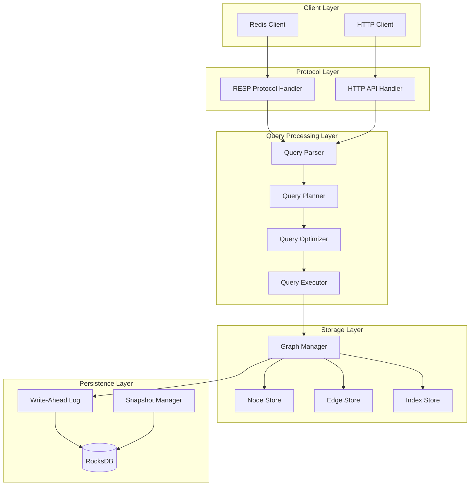
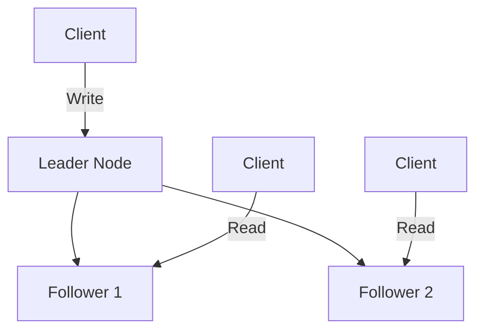

# Architecture

This page describes the internal architecture of Graphmind for users who want to understand how the system works.

## High-Level Overview



## Module Structure

```
src/
  graph/           Property graph model (nodes, edges, properties, store)
  query/           OpenCypher parser (Pest PEG), AST, planner, optimizer, executor
  protocol/        RESP protocol handler, TCP server, command dispatch
  http/            Axum HTTP server, REST API handlers, static file serving
  persistence/     RocksDB storage, WAL, multi-tenant column families
  raft/            Raft consensus (openraft), state machine, cluster management
  vector/          HNSW vector index
  snapshot/        Portable .sgsnap export/import
  nlq/             Natural language query pipeline (LLM providers)
  algo/            Graph algorithms (PageRank, BFS, WCC, etc.)
  sharding/        Tenant-level sharding
  agent/           Agentic enrichment (GAK)
```

## Storage Engine

### In-Memory Graph Store

The primary data structure is an in-memory property graph:

```
GraphStore {
    nodes:    HashMap<NodeId, Node>        -- O(1) node lookup
    edges:    HashMap<EdgeId, Edge>        -- O(1) edge lookup
    outgoing: HashMap<NodeId, Vec<EdgeId>> -- Adjacency list (outgoing)
    incoming: HashMap<NodeId, Vec<EdgeId>> -- Adjacency list (incoming)
    indices:  IndexStore                   -- Label and property indexes
}
```

- **O(1) lookups** for nodes and edges by ID
- **Adjacency lists** for efficient traversal (no join tables)
- **RoaringBitmap** label indexes for fast `MATCH (n:Label)` scans
- **BTree** property indexes for range queries (`WHERE n.age > 30`)

### Persistence

Writes are persisted to RocksDB through a Write-Ahead Log (WAL). On startup, Graphmind recovers all data from RocksDB into memory. Multi-tenancy uses RocksDB column families with tenant-prefixed keys.

## Query Processing

### Parser

Graphmind uses a [Pest PEG grammar](https://pest.rs/) (`src/query/cypher.pest`) to parse Cypher queries into an AST. The grammar uses atomic keyword rules to prevent false matches at word boundaries.

### Planner and Optimizer

The query planner converts the AST into an execution plan:

1. **Logical planning** -- AST to logical operators
2. **Rule-based optimization** -- predicate pushdown, index selection, constant folding
3. **Cost-based optimization** -- cardinality estimation, plan enumeration, cost model
4. **Physical planning** -- logical operators to physical operators

### Executor (Volcano Iterator Model)

Execution uses the Volcano iterator model -- a lazy, pull-based pipeline:

```
ProjectOperator(b.name)
  FilterOperator(a.age > 30)
    ExpandOperator(-[:KNOWS]->)
      NodeScanOperator(:Person)
```

Each operator implements `next()` and pulls records one at a time from its child. This avoids materializing large intermediate results.

### Late Materialization

Scan and traversal operators pass lightweight references (`NodeRef(NodeId)`) through the pipeline instead of full node copies. Properties are resolved lazily only when projected or filtered. This yields 4-5x improvement in multi-hop query latency.

## Concurrency

- **Readers** share access via `RwLock` -- multiple concurrent read queries
- **Writers** get exclusive access -- one write at a time
- **MVCC foundation** -- versioned nodes/edges with `get_node_at_version()` for snapshot reads

## Distributed Architecture (Raft)

Graphmind uses [openraft](https://github.com/datafuselabs/openraft) for cluster coordination:



- **Writes** go to the leader, which replicates to followers before acknowledging
- **Reads** can go to any node (followers serve reads from local state)
- **Leader election** happens automatically on failure (majority quorum)
- **Linearizable** -- all nodes see the same order of operations

## ACID Properties

| Property | Implementation |
|----------|---------------|
| **Atomicity** | RocksDB WriteBatch -- multi-part writes (node + adjacency) are all-or-nothing |
| **Consistency** | Raft consensus ensures all replicas agree on operation order |
| **Isolation** | RwLock -- single writer, concurrent readers. MVCC foundation for future snapshot isolation |
| **Durability** | WAL + RocksDB persistence. In cluster mode, data is replicated before acknowledgment |

## Protocols

### RESP (port 6379)

Binary Redis protocol. Lower latency, persistent TCP connections. Commands: `GRAPH.QUERY`, `GRAPH.RO_QUERY`, `GRAPH.DELETE`, `GRAPH.LIST`, `PING`, `INFO`, `AUTH`.

### HTTP (port 8080)

REST API + web visualizer. Higher-level features: import/export, NLQ, schema introspection, Prometheus metrics, subgraph sampling.
