# Graphmind Graph Database - System Architecture

## Overview

This document describes the detailed architecture of Graphmind Graph Database with visual diagrams showing component interactions, data flows, and deployment models.

---

## 1. High-Level System Architecture

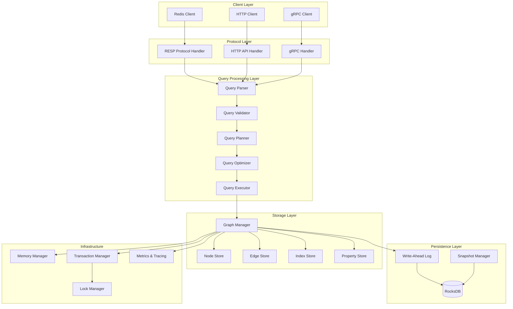

---

## 2. Component Architecture Details

### 2.1 Protocol Handler Layer

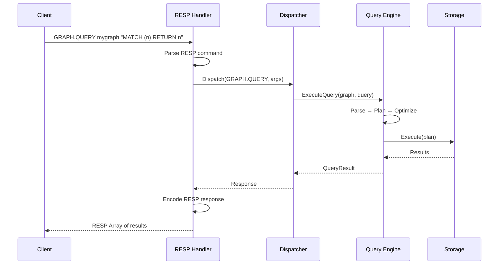

**RESP Command Flow**:
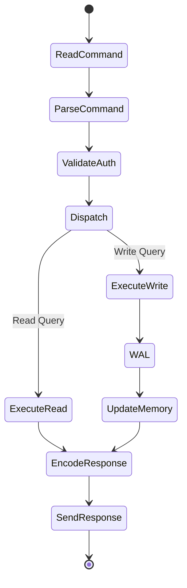

### 2.2 Query Processing Pipeline

```mermaid
graph LR
    subgraph "Parsing Phase"
        CQ[Cypher Query] --> LEX[Lexer]
        LEX --> PAR[Parser]
        PAR --> AST[Abstract Syntax Tree]
    end

    subgraph "Validation Phase"
        AST --> SEM[Semantic Analyzer]
        SEM --> TYPE[Type Checker]
        TYPE --> VAST[Validated AST]
    end

    subgraph "Planning Phase"
        VAST --> LP[Logical Planner]
        LP --> LPLAN[Logical Plan]
        LPLAN --> PP[Physical Planner]
        PP --> PPLAN[Physical Plan]
    end

    subgraph "Optimization Phase"
        PPLAN --> RBO[Rule-Based Optimizer]
        RBO --> CBO[Cost-Based Optimizer]
        CBO --> OPLAN[Optimized Plan]
    end

    subgraph "Execution Phase"
        OPLAN --> EXE[Executor]
        EXE --> RES[Results]
    end

```

**Example Query Execution Plan**:
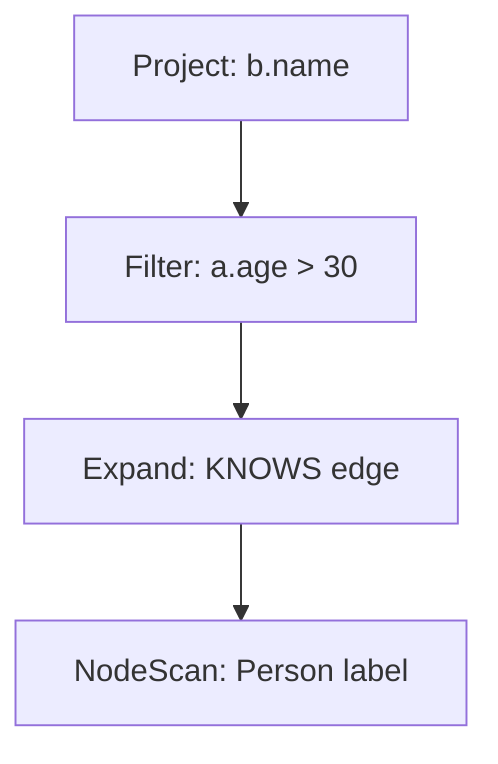

### 2.3 Storage Engine Architecture

```mermaid
graph TB
    subgraph "In-Memory Graph Store"
        direction TB
        NM[Node Manager]
        EM[Edge Manager]
        PM[Property Manager]
        IM[Index Manager]

        subgraph "Node Storage"
            NH[Node HashMap<br/>NodeId → Node]
            NL[Label Index<br/>Label → NodeIds]
        end

        subgraph "Edge Storage"
            EH[Edge HashMap<br/>EdgeId → Edge]
            ADJ_OUT[Outgoing Adjacency<br/>NodeId → EdgeIds]
            ADJ_IN[Incoming Adjacency<br/>NodeId → EdgeIds]
        end

        subgraph "Property Storage"
            PC[Property Columns<br/>Columnar Storage]
            PI[Property Index<br/>Hash/BTree]
        end

        subgraph "Indices"
            LI[Label Index<br/>RoaringBitmap]
            PRI[Property Index<br/>RoaringBitmap]
        end

        NM --> NH
        NM --> NL
        EM --> EH
        EM --> ADJ_OUT
        EM --> ADJ_IN
        PM --> PC
        PM --> PI
        IM --> LI
        IM --> PRI
    end

    subgraph "Persistence Layer"
        RDB[(RocksDB)]
        CF1[Column Family: nodes]
        CF2[Column Family: edges]
        CF3[Column Family: wal]
        CF4[Column Family: metadata]

        RDB --> CF1
        RDB --> CF2
        RDB --> CF3
        RDB --> CF4
    end

    NM -.->|Persist| CF1
    EM -.->|Persist| CF2
    PM -.->|WAL| CF3

```

**Data Structures**:
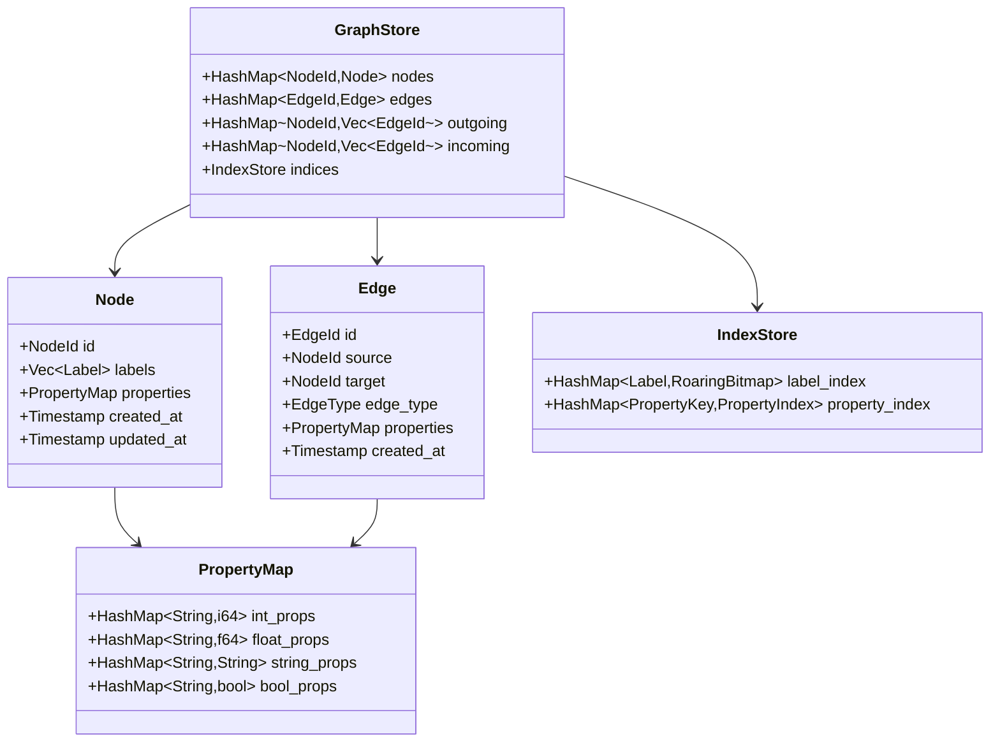

### 2.4 Memory Management

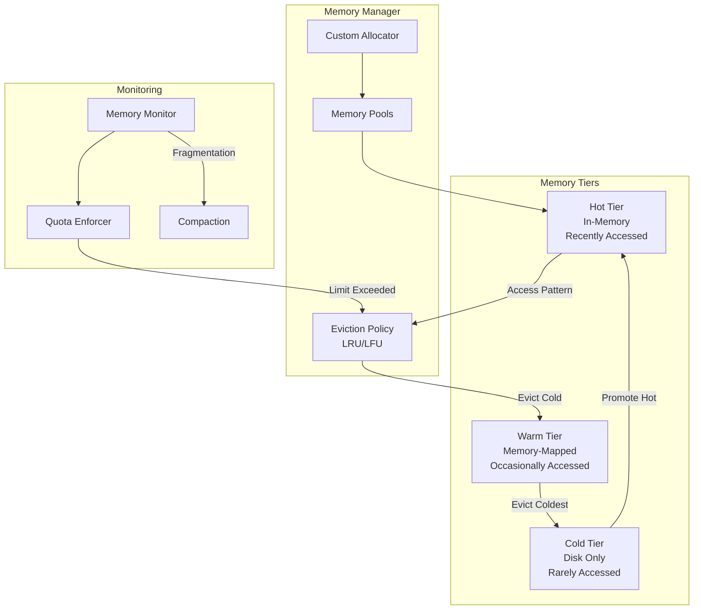

---

## 3. Distributed Architecture (Phase 3+)

### 3.1 Cluster Topology

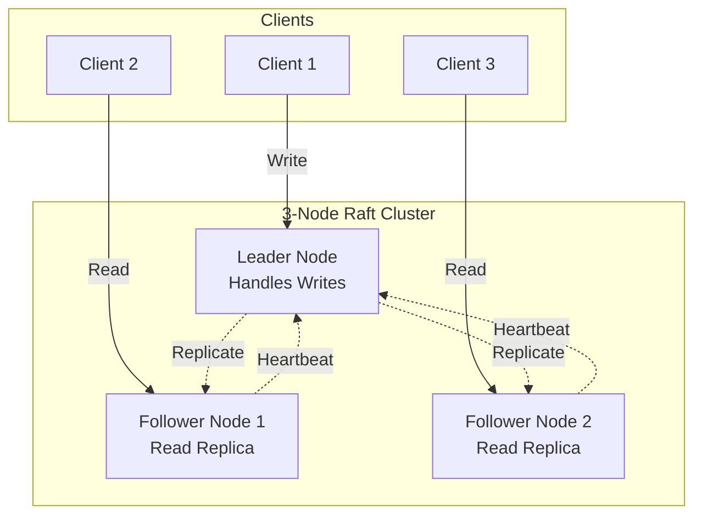

### 3.2 Raft Consensus Flow

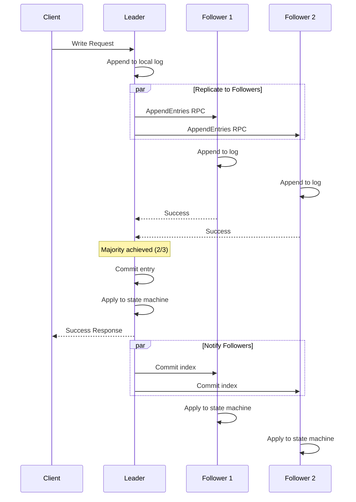

### 3.3 Leader Election

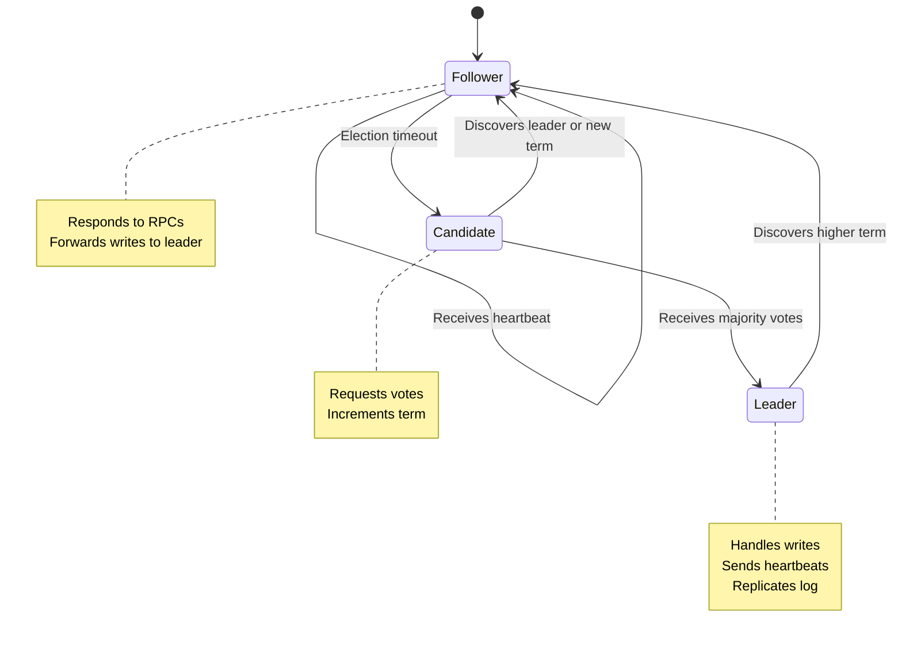

---

## 4. Query Execution Architecture

### 4.1 Volcano Iterator Model

```mermaid
graph TB
    subgraph "Query Plan Tree"
        PROJ[ProjectOperator<br/>SELECT b.name]
        FILT[FilterOperator<br/>WHERE a.age > 30]
        EXP[ExpandOperator<br/>-[:KNOWS]->]
        SCAN[NodeScanOperator<br/>MATCH :Person]
    end

    PROJ --> FILT
    FILT --> EXP
    EXP --> SCAN

```

### 4.2 Query Optimization

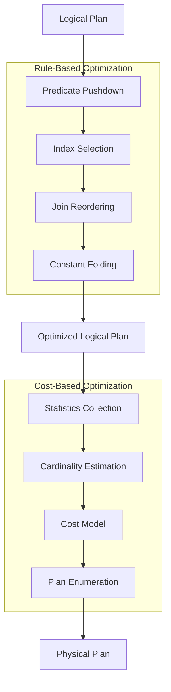

---

## 5. Multi-Tenancy Architecture

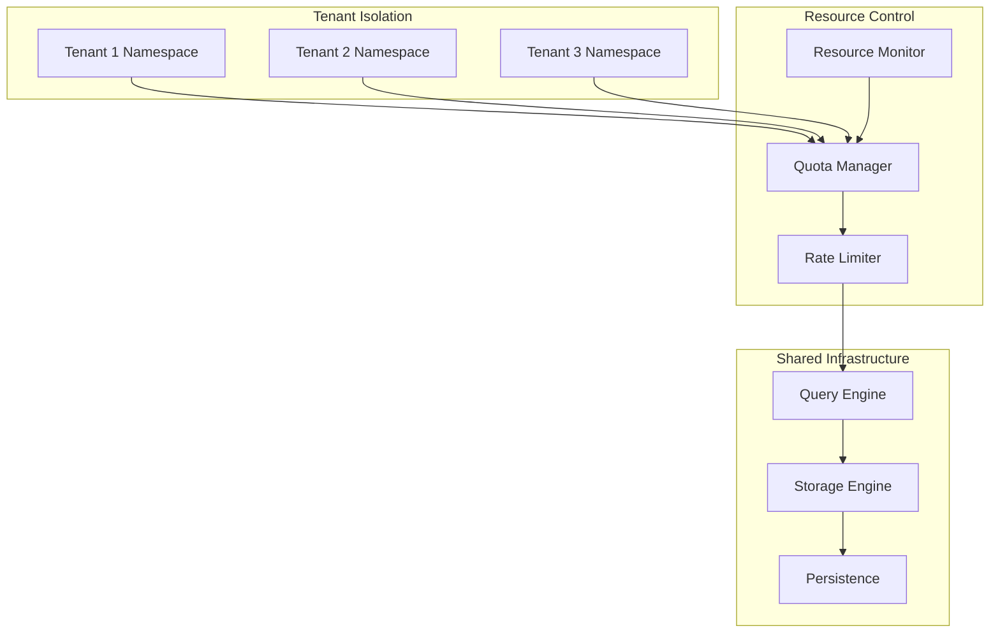

---

## 6. Persistence and Recovery

### 6.1 Write-Ahead Log (WAL)

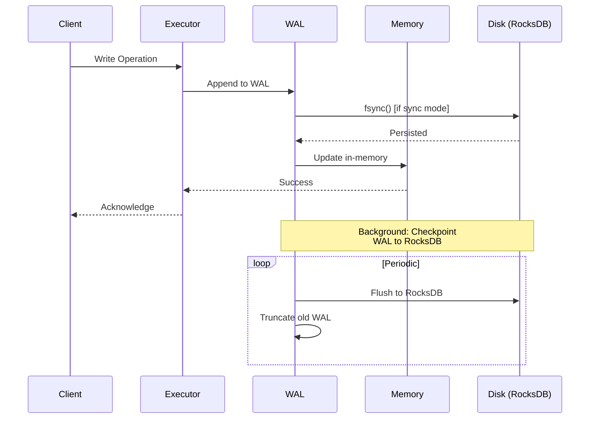

### 6.2 Recovery Process

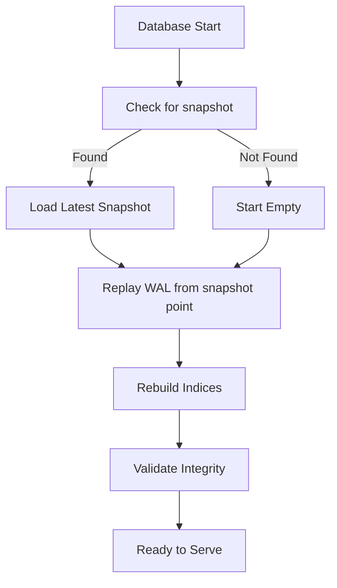

---

## 7. Deployment Architecture

### 7.1 Single-Node Deployment

```mermaid
graph TB
    subgraph "Docker Container"
        SRV[Graphmind Server]
        RDB[(RocksDB Data)]
        CFG[Config Files]
        LOG[Logs]
    end

    subgraph "Host Machine"
        VOL1[/data Volume]
        VOL2[/config Volume]
        VOL3[/logs Volume]
    end

    RDB -.->|Mount| VOL1
    CFG -.->|Mount| VOL2
    LOG -.->|Mount| VOL3

    LB[Load Balancer] --> SRV

    CLIENT1[Client 1] --> LB
    CLIENT2[Client 2] --> LB
    CLIENT3[Client 3] --> LB

```

### 7.2 Kubernetes Deployment (HA Cluster)

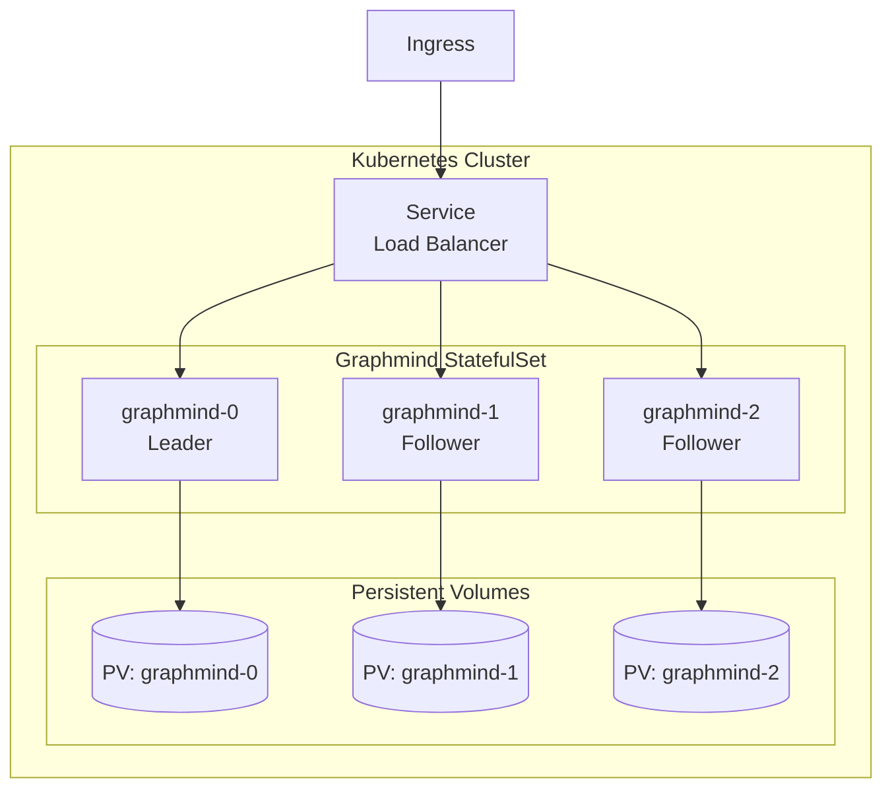

---

## Summary

This architecture provides:

- **Modularity**: Clear separation of concerns
- **Scalability**: From single-node to distributed cluster
- **Performance**: Multi-tier caching, optimized data structures
- **Reliability**: WAL, snapshots, Raft consensus
- **Observability**: Comprehensive metrics, tracing, logging
- **Security**: Multi-layer security architecture
- **Flexibility**: Multiple protocols, deployment options

**Key Design Principles**:
1. **Start Simple**: Single-node first, distribute later
2. **Optimize for Reads**: In-memory caching, indices
3. **Durability First**: WAL before acknowledgment
4. **Fail-Safe**: Raft quorum, split-brain prevention
5. **Observable**: Metrics and traces at every layer
